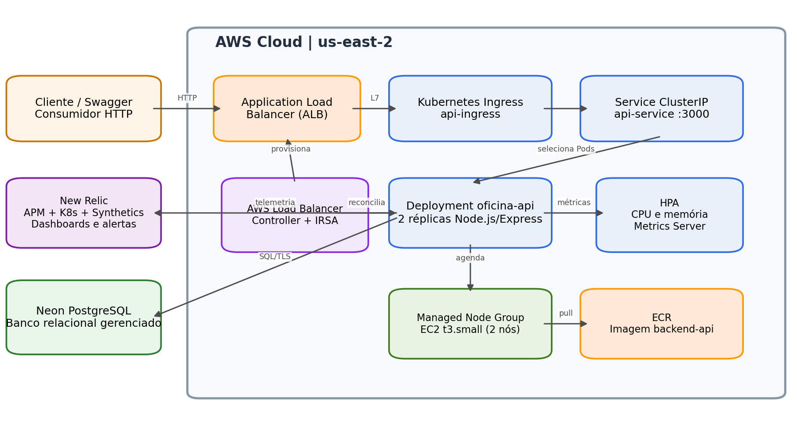
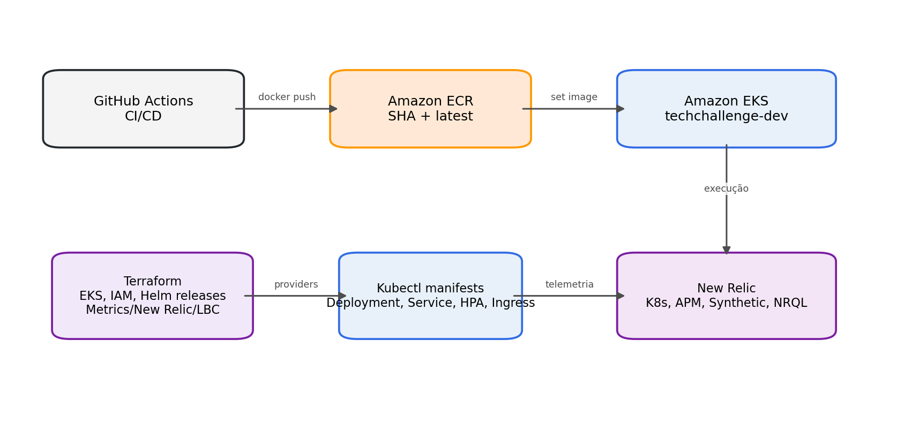
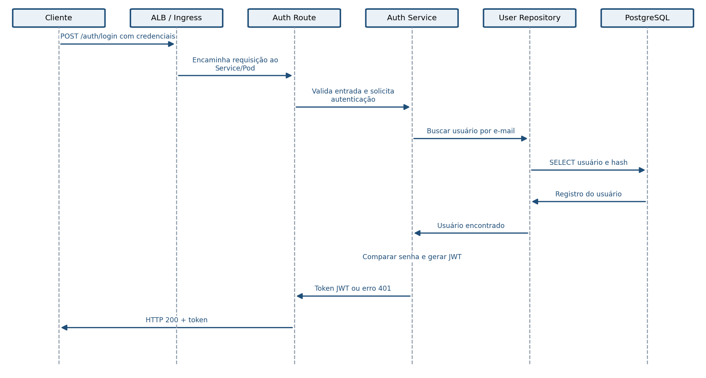
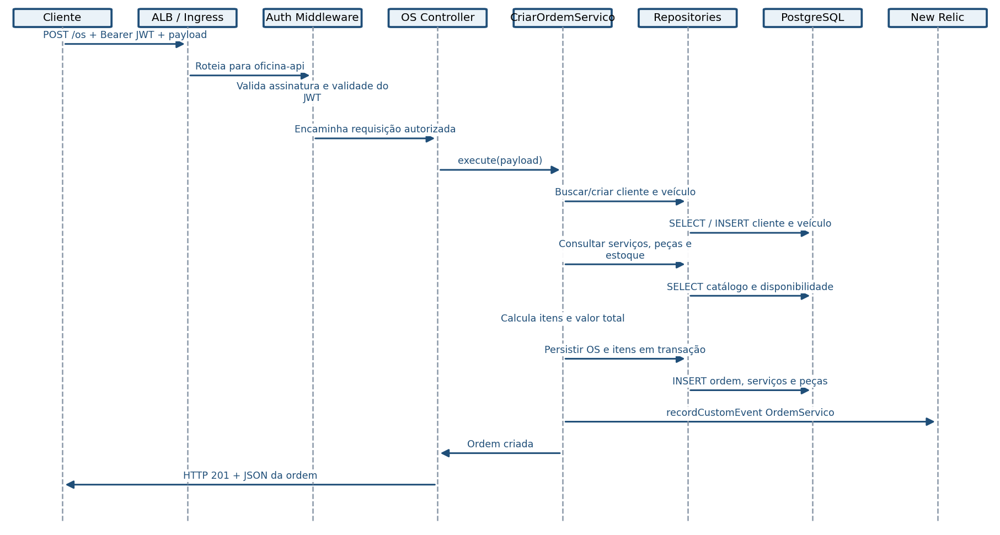
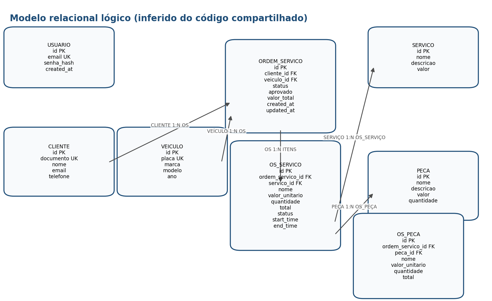

# Documentação de Arquitetura

**Tech Challenge FIAP | Plataforma de Oficina e Ordens de Serviço**

Visão arquitetural consolidada da solução

Autor: Bruno Augusto Mathias

Versão: 1.0

Data: 10 de setembro de 2026

Estado: Arquitetura implementada e validada em ambiente de desenvolvimento

# Controle do documento

| **Campo** | **Valor** |
|----|----|
| Documento | Documentação de Arquitetura da Plataforma de Oficina |
| Escopo | Aplicação Node.js em Kubernetes, infraestrutura AWS, banco PostgreSQL, segurança, CI/CD e observabilidade |
| Público-alvo | Banca técnica, desenvolvimento, arquitetura e operações |
| Classificação | Acadêmico / Técnico |
| Fonte | Histórico de implementação, código compartilhado e decisões registradas durante o Tech Challenge |

# Resumo executivo

A solução implementa uma API de gestão de oficina e ordens de serviço em Node.js/Express, empacotada em contêineres e executada em Amazon EKS. O tráfego externo é recebido por um Application Load Balancer provisionado pelo AWS Load Balancer Controller a partir de um recurso Kubernetes Ingress. A persistência utiliza PostgreSQL gerenciado pela Neon, enquanto o New Relic fornece observabilidade de infraestrutura Kubernetes, APM, monitor sintético, eventos de negócio, dashboards e alertas.

A infraestrutura é provisionada predominantemente com Terraform, incluindo EKS, IAM/IRSA, add-ons e releases Helm. Os manifests da aplicação são aplicados por GitHub Actions, que também constrói a imagem, publica no Amazon ECR, atualiza o Deployment e aguarda o rollout. A arquitetura prioriza portabilidade, escalabilidade horizontal, rastreabilidade e automação.

## Premissas e limites

- O modelo ER incluído é lógico e foi inferido do código compartilhado; nomes físicos, constraints e tipos devem ser reconciliados com as migrations SQL do repositório.

- A autenticação foi documentada como JWT Bearer, conforme o middleware e variáveis JWT apresentados.

- O ambiente atual foi usado como desenvolvimento/demonstração. Para produção, recomenda-se endpoint privado do EKS, HTTPS com ACM, rotação de segredos e política de backup formal.

- O ALB é um recurso derivado do Ingress e não pertence diretamente ao state do Terraform. A sequência de desligamento deve excluir o Ingress enquanto o controller e o cluster ainda estiverem ativos.

# Sumário

**1.** Contexto e requisitos arquiteturais

**2.** Visão arquitetural e diagramas

**3.** Fluxos de sequência

**4.** Modelo de dados e justificativa do banco

**5.** RFCs

**6.** ADRs

**7.** Segurança

**8.** Disponibilidade, escalabilidade e observabilidade

**9.** CI/CD e operação

**10.** Riscos, débitos e recomendações

**11.** Referências

# 1. Contexto e requisitos arquiteturais

A plataforma gerencia clientes, veículos, catálogo de serviços e peças, autenticação e o ciclo de vida das ordens de serviço. O ciclo observado no domínio inclui Recebida, Em diagnóstico, Aguardando aprovação, Em execução, Finalizada e Entregue.

## 1.1 Atributos de qualidade

| **Atributo** | **Tratamento arquitetural** |
|----|----|
| Disponibilidade | Múltiplas réplicas da API, probes, ALB, EKS gerenciado e banco externo gerenciado. |
| Escalabilidade | HPA baseado em CPU/memória e Managed Node Group com limite mínimo/máximo. |
| Observabilidade | New Relic Kubernetes, APM Node.js, Synthetics, eventos customizados e NRQL. |
| Segurança | JWT, Kubernetes Secret, IAM/IRSA, RBAC, tráfego TLS para PostgreSQL e segregação de responsabilidades. |
| Manutenibilidade | Arquitetura em camadas: interfaces, application, domain e infrastructure. |
| Portabilidade | Contêiner Docker e manifests Kubernetes independentes da máquina do desenvolvedor. |
| Automação | Terraform para infraestrutura e GitHub Actions para build, push e rollout. |

## 1.2 Restrições relevantes

- Uso obrigatório de Kubernetes.

- Infraestrutura com custos controlados e capacidade de destruição automatizada.

- Banco relacional devido à natureza transacional e aos relacionamentos do domínio.

- Necessidade de evidenciar métricas técnicas e de negócio em dashboards.

# 2. Visão arquitetural e diagramas

Figura 1. Diagrama de componentes com nuvem, APIs, banco e monitoramento

## 2.1 Responsabilidades dos componentes

| **Componente** | **Responsabilidade** |
|----|----|
| ALB | Terminação HTTP/HTTPS, health check e distribuição L7 para os targets da API. |
| AWS Load Balancer Controller | Observa Ingress/Service e reconcilia ALB, listeners, target groups e security groups. |
| Ingress api-ingress | Declara rota pública e health check /health; target type IP. |
| Service api-service | Descoberta e balanceamento interno para os pods na porta 3000. |
| Deployment oficina-api | Mantém réplicas desejadas da API Node.js/Express. |
| HPA + Metrics Server | Ajusta réplicas com base em CPU e memória. |
| Neon PostgreSQL | Persistência relacional, integridade e consultas transacionais. |
| New Relic | Métricas K8s, APM, uptime, traces, eventos customizados, dashboards e alertas. |
| Terraform | Provisionamento de EKS, IAM, OIDC/IRSA, add-ons e Helm releases. |
| GitHub Actions | Build, push ao ECR, aplicação dos manifests, secrets e rollout. |

Figura 2. Visão de implantação e automação

O Amazon EKS mantém o control plane Kubernetes gerenciado e distribuído em múltiplas zonas de disponibilidade, reduzindo o esforço operacional associado a API Server e etcd. A aplicação permanece no data plane composto por nós EC2 do Managed Node Group. \[R1\]\[R2\]

O AWS Load Balancer Controller observa recursos Ingress e provisiona um ALB; recursos Service do tipo LoadBalancer podem provisionar NLB. No desenho adotado, o Ingress cria o ALB e encaminha tráfego aos pods com target type IP. \[R6\]\[R7\]

# 3. Diagramas de sequência

## 3.1 Fluxo de autenticação

Figura 3. Sequência do fluxo de autenticação JWT

**1.** O cliente envia credenciais ao endpoint de autenticação.

**2.** A requisição atravessa ALB, Ingress e Service.

**3.** A camada de autenticação consulta o usuário no PostgreSQL.

**4.** A senha é comparada com o hash persistido.

**5.** Em sucesso, a API emite um JWT assinado; em falha, retorna 401.

**6.** Chamadas protegidas posteriores enviam o JWT no cabeçalho Authorization: Bearer.

## 3.2 Abertura de ordem de serviço

Figura 4. Sequência de abertura de ordem de serviço

**1.** O cliente envia POST /os com JWT e dados de cliente, veículo, serviços e peças.

**2.** O middleware valida o token.

**3.** O caso de uso busca ou cria cliente e veículo.

**4.** Serviços e peças são lidos do catálogo e validados.

**5.** O valor total é calculado.

**6.** A ordem e os itens são persistidos.

**7.** O evento customizado OrdemServico é enviado ao New Relic.

**8.** A API retorna 201 com a ordem criada.

# 4. Banco de dados e modelo relacional

## 4.1 Escolha formal do PostgreSQL

PostgreSQL foi escolhido por adequação ao domínio transacional. A abertura e evolução de uma ordem de serviço envolvem múltiplas entidades relacionadas, validação de estoque, integridade referencial e necessidade de consistência entre cabeçalho e itens. O modelo relacional permite constraints, chaves estrangeiras, transações ACID, índices compostos e consultas analíticas por status, período, cliente e veículo.

A hospedagem Neon foi adotada para reduzir esforço operacional e disponibilizar PostgreSQL gerenciado, compatível com drivers e frameworks PostgreSQL, com recursos de autoscaling, scale-to-zero, branching, restauração e pooling de conexões. \[R4\]\[R5\]

## 4.2 Comparação resumida

| **Critério** | **PostgreSQL/Neon** | **Alternativa NoSQL** | **Decisão** |
|----|----|----|----|
| Consistência multi-entidade | Transações e FK nativas | Frequentemente exige coordenação na aplicação | PostgreSQL |
| Relacionamentos | JOINs e modelo normalizado | Desnormalização e duplicação | PostgreSQL |
| Consultas de status e tempos | SQL agregado e índices | Modelagem específica por consulta | PostgreSQL |
| Evolução de esquema | Migrations controladas | Flexível, porém menos restritivo | PostgreSQL |
| Operação | Serviço gerenciado | Também disponível | Neon pelo baixo overhead |

Figura 5. Diagrama ER lógico inferido do domínio e dos repositórios

## 4.3 Relacionamentos e ajustes

| **Relacionamento** | **Cardinalidade** | **Justificativa** |
|----|----|----|
| Cliente → Ordem de Serviço | 1:N | Um cliente pode possuir várias ordens ao longo do tempo. |
| Veículo → Ordem de Serviço | 1:N | Um veículo pode retornar à oficina em múltiplas ocasiões. |
| Ordem → OS_Serviço | 1:N | Uma ordem possui um ou mais serviços contratados. |
| Serviço → OS_Serviço | 1:N | Um serviço de catálogo pode ser usado em várias ordens. |
| Ordem → OS_Peça | 1:N | Uma ordem pode consumir diversas peças. |
| Peça → OS_Peça | 1:N | Uma peça de catálogo pode ser usada em várias ordens. |
| Usuário | Independente ou associado | Suporta autenticação e autorização; vínculo com cliente depende da regra de negócio. |

## 4.4 Recomendações de modelagem

- Criar tabela de histórico de status com ordem_id, status, iniciado_em, finalizado_em e duracao_minutos. Isso elimina a dependência de updated_at para métricas de duração.

- Manter snapshots de nome, descrição e valor_unitario em OS_SERVICO e OS_PECA para preservar o valor histórico da ordem mesmo quando o catálogo mudar.

- Aplicar unique em cliente.documento, veiculo.placa e usuario.email.

- Criar índices em ordem_servico(cliente_id), ordem_servico(veiculo_id), ordem_servico(status, created_at) e nas FKs das tabelas de itens.

- Usar transação na criação da OS e na atualização de estoque para evitar ordens parcialmente persistidas.

- Representar valor monetário como NUMERIC(12,2), nunca float.

- Adicionar check constraints para quantidade \> 0, valor_total \>= 0 e status pertencente ao conjunto permitido.

# 5. RFCs - Request for Comments

As RFCs registram propostas e decisões técnicas relevantes, incluindo contexto, alternativas e consequências. O status “Aceita” indica a direção adotada pelo projeto.

## RFC-001 - Escolha da nuvem e plataforma de contêineres

| **Campo** | **Descrição** |
|----|----|
| Status | Aceita |
| Proposta | Executar a solução em AWS com Amazon EKS. |
| Alternativas consideradas | Kubernetes local, ECS/Fargate, VM/EC2 tradicional. |
| Justificativa | EKS atende ao requisito Kubernetes, integra-se a IAM, ECR, ALB e ofertará portabilidade de manifests. O control plane gerenciado reduz carga operacional. |
| Consequências | Maior complexidade e custo que um único servidor; exige disciplina de lifecycle e limpeza de recursos derivados. |

## RFC-002 - Escolha do banco de dados

| **Campo** | **Descrição** |
|----|----|
| Status | Aceita |
| Proposta | Usar PostgreSQL gerenciado pela Neon. |
| Alternativas consideradas | DynamoDB, MongoDB e PostgreSQL autogerenciado/RDS. |
| Justificativa | O domínio possui forte integridade relacional e operações transacionais. Neon reduz administração e mantém compatibilidade PostgreSQL. |
| Consequências | Dependência de serviço externo à VPC e necessidade de TLS, pooling, backup e controle de egress. |

## RFC-003 - Estratégia de autenticação

| **Campo** | **Descrição** |
|----|----|
| Status | Aceita |
| Proposta | JWT Bearer validado por middleware Express. |
| Alternativas consideradas | Sessão server-side, API key e OAuth/OIDC externo. |
| Justificativa | JWT é simples para API stateless e compatível com réplicas horizontais sem armazenamento de sessão. |
| Consequências | Revogação exige estratégia adicional; segredo deve ser rotacionado; tokens devem ter expiração curta. |

## RFC-004 - Exposição HTTP no EKS

| **Campo** | **Descrição** |
|----|----|
| Status | Aceita |
| Proposta | Ingress + AWS Load Balancer Controller + ALB com targets IP. |
| Alternativas consideradas | ALB e attachments geridos manualmente pelo Terraform; Service LoadBalancer; NGINX Ingress. |
| Justificativa | Evita attachments frágeis de nós dinâmicos e permite reconciliação Kubernetes-native. |
| Consequências | O ALB é recurso derivado do Ingress e requer procedimento de exclusão antes de destruir o cluster. |

## RFC-005 - Plataforma de observabilidade

| **Campo** | **Descrição** |
|----|----|
| Status | Aceita |
| Proposta | New Relic com nri-bundle, APM Node.js, Synthetic e eventos customizados. |
| Alternativas consideradas | Datadog, CloudWatch isolado, Prometheus/Grafana autogerenciados. |
| Justificativa | Cobertura unificada de infraestrutura, aplicação, uptime e métricas de negócio, com opção gratuita adequada ao desafio. |
| Consequências | Dependência SaaS, governança de ingestão e necessidade de proteger license keys. |

# 6. ADRs - Architecture Decision Records

## ADR-001 - Arquitetura em camadas

| **Campo** | **Descrição** |
|----|----|
| Status | Aceita |
| Decisão | Separar interfaces/routes/controllers, application/services, domain e infrastructure/repositories. |
| Motivação | Reduz acoplamento entre Express, regras de negócio e PostgreSQL; facilita testes e mudança de infraestrutura. |
| Consequências | Mais arquivos e necessidade de manter contratos entre camadas. |

## ADR-002 - Comunicação síncrona REST/JSON

| **Campo** | **Descrição** |
|----|----|
| Status | Aceita |
| Decisão | Expor APIs HTTP REST com payload JSON e documentação Swagger. |
| Motivação | Adequada ao escopo e à interação imediata do usuário. |
| Consequências | Processos longos e integrações críticas podem futuramente exigir mensagens assíncronas. |

## ADR-003 - Horizontal Pod Autoscaler

| **Campo** | **Descrição** |
|----|----|
| Status | Aceita |
| Decisão | Usar HPA com métricas de CPU e memória fornecidas pelo Metrics Server. |
| Motivação | Mantém capacidade alinhada à carga e demonstra elasticidade Kubernetes. |
| Consequências | Requests e limits precisam ser calibrados; o node group também deve suportar escala. |

## ADR-004 - Probes independentes de disponibilidade externa

| **Campo** | **Descrição** |
|----|----|
| Status | Aceita |
| Decisão | Usar /health nas probes de liveness/readiness e monitor sintético externo. |
| Motivação | Kubernetes reage à saúde interna e New Relic mede disponibilidade ponta a ponta. |
| Consequências | O endpoint deve ser leve e não expor dados sensíveis. |

## ADR-005 - Eventos customizados para métricas de negócio

| **Campo** | **Descrição** |
|----|----|
| Status | Aceita |
| Decisão | Publicar OrdemServico, StatusOS, FalhaIntegracao e FalhaProcessamentoOS no New Relic. |
| Motivação | Permite dashboards de volume, duração por status e falhas sem consultas diretas ao banco. |
| Consequências | Eventos não são retroativos; atributo de duração depende da qualidade do timestamp de transição. |

## ADR-006 - Segredos fornecidos pelo pipeline

| **Campo** | **Descrição** |
|----|----|
| Status | Aceita |
| Decisão | Criar api-secret a partir de GitHub Actions Secrets antes de aplicar o Deployment. |
| Motivação | Evita credenciais reais no repositório e garante consistência do rollout. |
| Consequências | Requer cadastro e rotação dos secrets no ambiente production. |

## ADR-007 - Infraestrutura com Terraform e workload com manifests/CD

| **Campo** | **Descrição** |
|----|----|
| Status | Aceita com ressalva |
| Decisão | Terraform gerencia recursos AWS e Helm; GitHub Actions aplica Deployment, Service, HPA e Ingress. |
| Motivação | Separa lifecycle de plataforma e aplicação. |
| Consequências | Terraform destroy não remove Ingress gerido fora do state; exige runbook de teardown. |

# 7. Segurança

## 7.1 Controles implementados

- Autenticação por JWT em rotas protegidas.

- Segredos injetados por Kubernetes Secret criado no pipeline a partir de GitHub Actions Secrets.

- IAM separado para cluster, nodes e AWS Load Balancer Controller.

- IRSA via OIDC para conceder ao controller apenas permissões AWS necessárias.

- DB_PASSWORD fornecido como segredo e conexão PostgreSQL com SSL.

- Imagens versionadas pelo SHA do commit no ECR.

## 7.2 Recomendações

- Rotacionar credenciais previamente expostas em logs ou repositórios.

- Adotar GitHub OIDC para AWS em lugar de access keys estáticas.

- Restringir public_access_cidrs do endpoint EKS e priorizar acesso privado.

- Habilitar HTTPS no ALB com AWS Certificate Manager e redirecionamento HTTP→HTTPS.

- Adicionar NetworkPolicy, Pod Security Standards, image scanning e execução do container como usuário não-root.

- Usar External Secrets/AWS Secrets Manager para produção.

- Definir expiração, issuer, audience e rotação do segredo JWT.

# 8. Disponibilidade, escalabilidade e observabilidade

## 8.1 Escalabilidade

A API possui duas réplicas e HPA baseado em CPU/memória. O Metrics Server fornece a API metrics.k8s.io. O Managed Node Group foi dimensionado com dois nós t3.small, decisão motivada pelo limite de pods por nó observado durante a instalação do New Relic. O dimensionamento deve ser revisto para produção.

## 8.2 Observabilidade implementada

| **Requisito** | **Implementação** | **Evidência** |
|----|----|----|
| Latência de APIs | New Relic APM Node.js | Transactions, response time, throughput, error rate e traces. |
| CPU e memória K8s | nri-bundle + kube-state-metrics + Metrics Server | K8sNodeSample, K8sPodSample e K8sContainerSample. |
| Healthcheck e uptime | /health, probes e Synthetic Scripted API | Disponibilidade externa e reinício/remoção de pods não saudáveis. |
| Falha de processamento | FalhaProcessamentoOS + alerta NRQL | count(\*) \> 0 no intervalo definido. |
| Logs e correlação | APM e metadados K8s; logger JSON/correlation ID recomendado | Requisito parcialmente atendido enquanto console.log/error não forem substituídos. |
| Volume diário | Evento OrdemServico | NRQL count(\*) TIMESERIES 1 day. |
| Tempo por status | Evento StatusOS com duracaoStatusMinutos | NRQL average FACET statusAnterior. |
| Falhas de integração | Evento FalhaIntegracao | NRQL count(\*) FACET sistema. |

## 8.3 Consultas NRQL de referência

**Volume diário:** FROM OrdemServico SELECT count(\*) TIMESERIES 1 day SINCE 7 days ago

**Tempo médio por status:** FROM StatusOS SELECT average(duracaoStatusMinutos) WHERE statusAnterior IN ('Em diagnóstico','Em execução','Finalizada') FACET statusAnterior SINCE 7 days ago

**Falhas de integração:** FROM FalhaIntegracao SELECT count(\*) FACET sistema SINCE 7 days ago

**Falhas de processamento:** FROM FalhaProcessamentoOS SELECT count(\*) FACET operacao SINCE 7 days ago

**Requisições de negócio por minuto:** FROM Transaction SELECT rate(count(\*), 1 minute) WHERE appName = 'oficina-api' AND name NOT LIKE '%/health%' AND name NOT LIKE '%/api-docs%' TIMESERIES

A integração New Relic para Kubernetes coleta telemetria do cluster e pode vincular metadados de cluster, node, namespace, deployment, pod, container e imagem às entidades APM. \[R3\]\[R4\]

# 9. CI/CD e operação

## 9.1 Fluxo de entrega

**1.** Push na branch main.

**2.** Checkout e autenticação na AWS.

**3.** Login no ECR.

**4.** Build do diretório backEnd e push das tags SHA e latest.

**5.** Atualização do kubeconfig para techchallenge-dev.

**6.** Validação dry-run dos manifests.

**7.** Criação/atualização de api-secret com seis chaves vindas do ambiente production.

**8.** Aplicação de ConfigMap, Deployment, Service, HPA e Ingress.

**9.** kubectl set image com a imagem por SHA.

**10.** kubectl rollout status e diagnóstico automático em caso de falha.

## 9.2 Runbook de desligamento seguro

**1.** Desabilitar no CD a aplicação automática de ingress.yaml.

**2.** Com o cluster ativo, executar kubectl delete ingress api-ingress.

**3.** Aguardar o AWS Load Balancer Controller excluir ALB, listeners, target groups e security groups gerenciados.

**4.** Confirmar ausência do ALB com aws elbv2 describe-load-balancers.

**5.** Executar terraform destroy para recursos de plataforma.

**6.** Remover contextos kubeconfig obsoletos.

O controller cria recursos ELB a partir de Ingress/Service e os mantém reconciliados. Excluir primeiro o cluster pode deixar recursos órfãos, pois o controller deixa de existir antes de processar o finalizer. \[R6\]\[R7\]

## 9.3 Recuperação operacional

- Rollout com falha: kubectl get pods, describe pod, events e logs --previous.

- Secret ausente: validar DATA=6 e chave NEW_RELIC_LICENSE_KEY antes do Deployment.

- Kubeconfig obsoleto: aws eks update-kubeconfig enquanto o cluster existir.

- Pod Pending por limite: revisar capacidade de pods, nós e requests/limits.

- ALB órfão após exclusão do cluster: remover manualmente ALB, target groups e security groups após validação de tags.

# 10. Riscos, débitos e recomendações

| **ID** | **Risco / débito** | **Impacto** | **Tratamento recomendado** |
|----|----|----|----|
| R-01 | Ingress não gerido no state Terraform | ALB órfão e custo após destroy | Automatizar pre-destroy ou gerir manifests via provider Kubernetes/GitOps. |
| R-02 | Mistura potencial de EKS Auto Mode e Managed Node Group | Ambiguidade de capacidade e custo | Escolher uma única estratégia de compute. |
| R-03 | updated_at usado para duração de status | Métrica incorreta se outra atualização alterar o campo | Criar histórico de status dedicado. |
| R-04 | Segredos estáticos no CI | Exposição e rotação complexa | GitHub OIDC + Secrets Manager/External Secrets. |
| R-05 | Endpoint EKS público 0.0.0.0/0 | Superfície de ataque maior | Restringir CIDRs e ativar acesso privado. |
| R-06 | HTTP no ALB | Tráfego sem criptografia ponta a ponta | ACM, listener 443 e redirect 80→443. |
| R-07 | Logs da aplicação não padronizados integralmente | Correlação e busca incompletas | Pino JSON + correlationId + trace.id/span.id. |
| R-08 | t3.small e limite de pods | Pressão de capacidade | Ajustar instâncias, prefix delegation e autoscaling conforme carga. |

# 11. Referências

**\[R1\]** AWS. EKS Control Plane. <u>https://docs.aws.amazon.com/eks/latest/best-practices/control-plane.html</u>

**\[R2\]** AWS. Amazon EKS architecture. <u>https://docs.aws.amazon.com/eks/latest/userguide/eks-architecture.html</u>

**\[R3\]** New Relic. Link APM-instrumented applications to Kubernetes. <u>https://docs.newrelic.com/docs/kubernetes-pixie/kubernetes-integration/advanced-configuration/link-apm-applications-kubernetes/</u>

**\[R4\]** New Relic. Install the Kubernetes integration. <u>https://docs.newrelic.com/install/kubernetes/</u>

**\[R5\]** Neon. Lakebase Postgres overview. <u>https://neon.com/docs/postgres/overview</u>

**\[R6\]** AWS Load Balancer Controller documentation. <u>https://kubernetes-sigs.github.io/aws-load-balancer-controller/latest/</u>

**\[R7\]** AWS. Route internet traffic with AWS Load Balancer Controller. <u>https://docs.aws.amazon.com/eks/latest/userguide/aws-load-balancer-controller.html</u>

**\[R8\]** AWS. Application Load Balancers for EKS. <u>https://docs.aws.amazon.com/eks/latest/userguide/alb-ingress.html</u>

Acesso às referências: 10 de setembro de 2026.

# Apêndice A - Checklist de aceite

| **Item** | **Status** | **Observação** |
|----|----|----|
| Diagrama de componentes | Atendido | Inclui AWS, API, Kubernetes, banco e New Relic. |
| Sequência de autenticação | Atendido | Fluxo JWT documentado. |
| Sequência de abertura da OS | Atendido | Inclui validação, persistência e telemetria. |
| RFCs | Atendido | Nuvem, banco, autenticação, exposição e observabilidade. |
| ADRs | Atendido | Camadas, REST, HPA, probes, eventos, secrets e IaC. |
| Justificativa do banco | Atendido | Análise formal e comparação de alternativas. |
| Diagrama ER | Atendido com validação pendente | Modelo lógico inferido; reconciliar com migrations. |
| Operação e teardown | Atendido | Runbook evita ALB órfão. |
| Logs JSON + correlação | Parcial | Recomendado como próxima melhoria para atendimento literal. |
