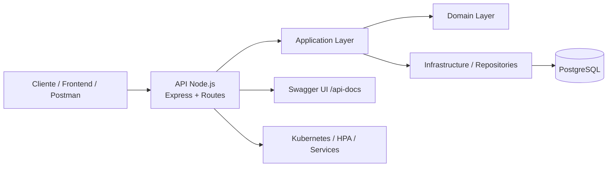

# TechChallengerFiap-Application

## Propósito

Este repositório concentra a API principal do sistema de oficina mecânica. Ele é responsável por gerenciar clientes, veículos, serviços, peças, ordens de serviço, autenticação JWT e documentação OpenAPI/Swagger da aplicação.

## Tecnologias utilizadas

- Node.js 18+
- Express 5
- PostgreSQL 15
- JWT (jsonwebtoken)
- Swagger JSdoc + Swagger UI
- Jest + Supertest
- Docker / Docker Compose
- Kubernetes + Kind
- Terraform
- New Relic

## Arquitetura específica do repositório



A aplicação segue uma organização em camadas com domínio, aplicação, infraestrutura e interfaces HTTP, permitindo regras de negócio independentes do framework e da persistência.

## Como executar

### 1) Opção recomendada com Docker

```bash
cd TechChallengerFiap-Application/backEnd
docker-compose up --build
```

A API ficará disponível em:

- Swagger: http://localhost:3000/api-docs
- API: http://localhost:3000
- PostgreSQL: localhost:5433
- pgAdmin: http://localhost:5050

### 2) Execução local sem Docker

```bash
cd TechChallengerFiap-Application/backEnd
npm install
cp .env.example .env
npm run dev
```

Se desejar rodar em produção:

```bash
npm start
```

## Deploy

### Kubernetes

```bash
cd TechChallengerFiap-Application
kubectl apply -f backEnd/k8s/
```

Principais recursos:

- Deployment da API
- Service LoadBalancer
- PostgreSQL em um pod separado
- PVC persistente
- HPA para escalabilidade

### Terraform

```bash
cd TechChallengerFiap-Application/backEnd/terraForm
terraform init
terraform plan
terraform apply
```

## Passos para deploy e execução

1. Preparar o banco PostgreSQL.
2. Configurar variáveis de ambiente no arquivo `.env`.
3. Rodar a aplicação localmente ou via Docker Compose.
4. Validar a API no Swagger.
5. Aplicar manifestos Kubernetes ou provisionar o ambiente com Terraform.
6. Verificar health check:

```bash
curl http://localhost:3000/health
```

## Link para Swagger / Postman

- Swagger principal da API: http://localhost:3000/api-docs
- Swagger pode ser usado como documentação interativa dos endpoints.
- Para uso em Postman, importe a documentação OpenAPI gerada em `/api-docs` e teste os endpoints em JSON.

## Estrutura principal

```text
TechChallengerFiap-Application/
├── backEnd/
│   ├── src/
│   ├── db/
│   ├── k8s/
│   ├── terraForm/
│   ├── tests/
│   ├── Dockerfile
│   ├── docker-compose.yml
│   └── package.json
├── README.md
└── Doc_Arquitetura/
```

## Funcionalidades principais

- Cadastro e consulta de clientes
- Cadastro e consulta de veículos
- Gestão de serviços e peças
- Criação e acompanhamento de ordens de serviço
- Aprovação de orçamento e evolução de status
- Autenticação via JWT
- Health check para Kubernetes

---

## ✅ Funcionalidades

### Autenticação
- `POST /login` — Gera token JWT (credenciais via variáveis de ambiente)

### Clientes
- `GET /clientes` — Lista todos os clientes
- `GET /clientes/:id` — Busca cliente por ID
- `POST /clientes` — Cadastra novo cliente (validação de CPF/CNPJ)
- `PUT /clientes/:id` — Atualiza dados do cliente
- `DELETE /clientes/:id` — Remove cliente

### Veículos
- `GET /veiculos` — Lista todos os veículos
- `GET /veiculos/:id` — Busca veículo por ID
- `POST /veiculos` — Cadastra novo veículo (validação de placa)
- `PUT /veiculos/:id` — Atualiza dados do veículo
- `DELETE /veiculos/:id` — Remove veículo

### Serviços
- `GET /servicos` — Lista todos os serviços
- `GET /servicos/:id` — Busca serviço por ID
- `POST /servicos` — Cadastra novo serviço
- `PUT /servicos/:id` — Atualiza serviço
- `DELETE /servicos/:id` — Remove serviço

### Peças
- `GET /pecas` — Lista todas as peças
- `GET /pecas/:id` — Busca peça por ID
- `POST /pecas` — Cadastra nova peça
- `PUT /pecas/:id` — Atualiza peça
- `DELETE /pecas/:id` — Remove peça

### Ordens de Serviço
- `POST /os` — Abre nova ordem (recebe cliente, veículo, serviços e peças; retorna o identificador da OS)
- `GET /os` — Lista ordens ordenadas por status (Em Execução > Aguardando Aprovação > Em diagnóstico > Recebida), excluindo Finalizadas e Entregues
- `GET /os/:id` — Consulta a OS por ID
- `GET /os/consulta/:id` — Consulta pública do status atual da OS
- `GET /os/cliente/:documento` — Lista ordens por cliente
- `PATCH /os/:id/status` — Atualiza status da OS
- `PATCH /os/:id/approve` — Recebe aprovação ou recusa do orçamento
- `PATCH /os/:id/advance` — Avança a OS para o próximo status
- `GET /os/:id/servicos-finalizados` — Lista os serviços finalizados da OS

### Saúde
- `GET /health` — Endpoint de health check para liveness/readiness probes do Kubernetes

> Todos os endpoints (exceto `/login` e `/health`) exigem autenticação via `Bearer Token`.

---

## 📦 Pré-requisitos

**Para execução local (Docker):**
- [Docker](https://www.docker.com/) e [Docker Compose](https://docs.docker.com/compose/)

**Para execução local (sem Docker):**
- [Node.js 18+](https://nodejs.org/) e [PostgreSQL 15+](https://www.postgresql.org/)

**Para deploy em Kubernetes:**
- [Docker Desktop](https://www.docker.com/products/docker-desktop/) com Kubernetes habilitado, **ou** [Kind](https://kind.sigs.k8s.io/)
- [kubectl](https://kubernetes.io/docs/tasks/tools/)

**Para provisionamento com Terraform:**
- [Terraform ≥ 1.5.0](https://developer.hashicorp.com/terraform/install)
- [Kind](https://kind.sigs.k8s.io/docs/user/quick-start/#installation) instalado e no PATH
- [Docker](https://www.docker.com/) em execução

---

## 🚀 Execução Local

### Opção 1 — Com Docker Compose (recomendado)

Sobe a API, o banco PostgreSQL e o pgAdmin em um único comando:

```bash
# 1. Clone o repositório e entre na pasta do backend
cd backEnd

# 2. Suba os containers
docker-compose up --build
```

Serviços disponíveis após o start:

| Serviço | URL |
|---|---|
| API | http://localhost:3000 |
| Swagger | http://localhost:3000/api-docs |
| pgAdmin | http://localhost:5050 |
| PostgreSQL | localhost:5433 |

Credenciais do pgAdmin: `admin@admin.com` / `admin`

Para derrubar os containers:

```bash
docker-compose down
```

Para derrubar e remover os volumes (banco de dados):

```bash
docker-compose down -v
```

---

### Opção 2 — Sem Docker (execução direta com Node.js)

**1. Instale as dependências:**

```bash
cd backEnd
npm install
```

**2. Configure o banco de dados:**

Crie o banco `oficina` manualmente no PostgreSQL e execute os scripts de inicialização em ordem:

```bash
psql -U postgres -d oficina -f db/init/01_clientes.sql
psql -U postgres -d oficina -f db/init/02_veiculos.sql
psql -U postgres -d oficina -f db/init/03_servicos.sql
psql -U postgres -d oficina -f db/init/04_pecas.sql
psql -U postgres -d oficina -f db/init/05_ordens_servico.sql
psql -U postgres -d oficina -f db/init/06_os_servicos.sql
psql -U postgres -d oficina -f db/init/07_os_pecas.sql
```

**3. Configure o arquivo `.env`** (veja a seção [Variáveis de Ambiente](#-variáveis-de-ambiente))

**4. Inicie o servidor:**

```bash
# Desenvolvimento (com hot reload)
npm run dev

# Produção
npm start
```

---

## ☸️ Deploy em Kubernetes

> Os manifestos YAML estão em `backEnd/k8s/`. Todos os comandos devem ser executados a partir da raiz do repositório.

### Pré-requisito: build local da imagem Docker

O deployment usa `imagePullPolicy: IfNotPresent`, portanto a imagem precisa estar disponível localmente no Docker antes de aplicar os manifestos:

```bash
docker build -t backend-api:latest ./backEnd
```

### 1. Aplicar todos os manifestos

```bash
kubectl apply -f backEnd/k8s/
```

Isso criará, na ordem resolvida pelo Kubernetes:

1. `api-configmap.yaml` — ConfigMap com variáveis não-sensíveis
2. `api-secret.yaml` — Secret com variáveis sensíveis
3. `postgres-pvc.yaml` — Volume persistente para o PostgreSQL
4. `postgres-deployment.yaml` — Deployment do PostgreSQL
5. `postgres-service.yaml` — Service interno do PostgreSQL
6. `api-deployment.yaml` — Deployment da API (2 réplicas)
7. `api-service.yaml` — Service LoadBalancer da API
8. `api-hpa.yaml` — HPA (escala de 2 a 10 pods)

### 2. Verificar o status dos pods

```bash
kubectl get pods
kubectl get deployments
kubectl get svc
kubectl get hpa
```

Aguarde todos os pods estarem com status `Running` e `READY 1/1` ou `2/2`.

### 3. Acessar a API

**Docker Desktop:** O service é do tipo `LoadBalancer`, mas no Docker Desktop o port-forward é necessário:

```bash
kubectl port-forward service/api-service 3000:3000
```

A API estará disponível em: `http://localhost:3000`

**Kind / Minikube:** Use o IP do cluster ou port-forward igualmente:

```bash
# Kind — port-forward é o método recomendado
kubectl port-forward service/api-service 3000:3000

# Minikube — pode usar o IP diretamente
minikube service api-service --url
```

### 4. Verificar health check

```bash
curl http://localhost:3000/health
# Esperado: { "status": "ok" }
```

### 5. Remover todos os recursos

```bash
kubectl delete -f backEnd/k8s/
```

---

## 🌍 Provisionamento com Terraform

> Os scripts Terraform estão em `backEnd/terraForm/`. Eles provisionam um cluster Kind local e todos os recursos Kubernetes dentro dele — alternativa ao deploy manual com `kubectl`.

### O que o Terraform provisiona

| Recurso | Tipo | Descrição |
|---|---|---|
| `oficina-cluster` | `kind_cluster` | Cluster Kubernetes local com 1 control-plane + 1 worker |
| `api-secret` | `kubernetes_secret` | Credenciais sensíveis da aplicação |
| `api-config` | `kubernetes_config_map` | Variáveis de ambiente não-sensíveis |
| `postgres-pvc` | `kubernetes_persistent_volume_claim` | Volume de 1Gi para o PostgreSQL |
| `postgres` | `kubernetes_deployment` | Deploy do PostgreSQL 15 |
| `postgres-service` | `kubernetes_service` | Service ClusterIP do PostgreSQL |
| `oficina-api` | `kubernetes_deployment` | Deploy da API com 2 réplicas |
| `api-service` | `kubernetes_service` | Service LoadBalancer da API |
| `api-hpa` | `kubernetes_horizontal_pod_autoscaler_v2` | HPA com escala por CPU e memória |

### Pré-requisitos

- Terraform ≥ 1.5.0 instalado
- Kind instalado e no PATH
- Docker em execução
- Imagem Docker da API construída localmente:

```bash
docker build -t backend-api:latest ./backEnd
```

### Passos para provisionar

```bash
# 1. Entre na pasta do Terraform
cd backEnd/terraForm

# 2. Inicialize os providers (baixa hashicorp/kubernetes e tehcyx/kind)
terraform init

# 3. Revise o plano de execução
terraform plan

# 4. Aplique a infraestrutura
terraform apply
```

Confirme com `yes` quando solicitado. O processo cria o cluster Kind, aguarda ele ficar pronto e aplica todos os recursos Kubernetes.

### Variáveis configuráveis

As variáveis estão em `terraform.tfvars`. Os principais valores são:

| Variável | Padrão | Descrição |
|---|---|---|
| `cluster_name` | `oficina-cluster` | Nome do cluster Kind |
| `api_image` | `backend-api:latest` | Imagem Docker da API |
| `api_replicas` | `2` | Réplicas iniciais da API |
| `db_name` | `oficina` | Nome do banco de dados |
| `db_user` | `postgres` | Usuário do PostgreSQL |
| `db_password` | _(sensível)_ | Senha do PostgreSQL |
| `jwt_secret` | _(sensível)_ | Chave secreta JWT |
| `postgres_storage` | `1Gi` | Tamanho do volume persistente |

Para sobrescrever variáveis sem editar o arquivo:

```bash
terraform apply -var="db_password=minha_senha" -var="jwt_secret=meu_secret"
```

### Outputs após o apply

```bash
terraform output
```

Exibe:

- `cluster_name` — Nome do cluster criado
- `kubeconfig_path` — Caminho do kubeconfig gerado pelo Kind
- `api_url` — URL local para acessar a API
- `postgres_service_name` — Nome do Service interno do PostgreSQL
- `api_service_name` — Nome do Service da API

### Acessar a API após o Terraform

```bash
kubectl port-forward service/api-service 3000:3000
```

### Destruir a infraestrutura

```bash
terraform destroy
```

---

## 🔐 Variáveis de Ambiente

Crie um arquivo `.env` na raiz de `backEnd/` com o seguinte conteúdo:

```env
# Banco de dados
DB_USER=postgres
DB_HOST=localhost        # use "db" se estiver rodando via Docker
DB_NAME=oficina
DB_PASSWORD=sua_senha
DB_PORT=5433             # porta mapeada do Docker; use 5432 para local

# Usuário mock para autenticação
MOCK_USER_EMAIL=admin@oficina.com
MOCK_USER_PASSWORD=123456
MOCK_USER_ID=1

# JWT
JWT_SECRET=seu_segredo_aqui
```

> Para testes de integração, existe um `.env.test` separado com as configurações do banco de teste.

---

## 📖 Documentação da API

Com a aplicação rodando, acesse o Swagger UI em:

```
http://localhost:3000/api-docs
```

Todos os endpoints estão documentados com exemplos de request/response e esquemas de dados.

**Para autenticar no Swagger:**
1. Chame `POST /login` com email e senha
2. Copie o token retornado
3. Clique em **Authorize** (canto superior direito) e cole o token no campo `bearerAuth`

---

## 🧪 Testes

O projeto possui três níveis de testes:

### Testes Unitários

Testam as regras de negócio do Domain e os casos de uso da Application de forma isolada, sem dependência do banco.

```bash
npm run test:unit
```

### Testes de Integração

Testam os repositórios conectando ao banco de dados real (usando o `.env.test`).

```bash
npm run test:integration
```

Ou via Docker:

```bash
docker-compose run api-test
```

### Testes Funcionais

Testam os endpoints de ponta a ponta (HTTP → banco).

```bash
npm run test:functional
```

### Todos os testes

```bash
npm test
```

---

## 🔄 CI/CD

O pipeline está configurado em `.github/workflows/ci-cd.yml` e é disparado em pushes para as branches `master` e `main`.

**Etapas do pipeline:**

1. Checkout do código
2. Setup do Node.js 20
3. Instalação das dependências (`npm install`)
4. Build da aplicação
5. Execução dos testes unitários
6. Execução dos testes funcionais
7. Criação do `.env.test` para CI
8. Verificação da conexão com o PostgreSQL de serviço
9. Inicialização do banco de dados com os scripts SQL
10. Execução dos testes de integração
11. Login no Docker Hub
12. Build da imagem Docker (`bruno0games/backend-api:latest`)
13. Push da imagem para o Docker Hub
14. Atualização do manifesto `api-deployment.yaml` com a nova imagem
15. Criação de cluster Kind via `helm/kind-action@v1`
16. Aplicação dos manifestos Kubernetes (`kubectl apply -f backEnd/k8s/`)
17. Verificação dos recursos criados no cluster

**Secrets necessários no GitHub:**

| Secret | Descrição |
|---|---|
| `DOCKER_USER` | Usuário do Docker Hub |
| `DOCKER_PASSWORD` | Senha/token do Docker Hub |
| `MOCK_USER_EMAIL` | E-mail do usuário mock |
| `MOCK_USER_PASSWORD` | Senha do usuário mock |
| `MOCK_USER_ID` | ID do usuário mock |

---

## 📁 Estrutura do Projeto

```
TechChallengerFiap/
├── .github/
│   └── workflows/
│       └── ci-cd.yml                # Pipeline GitHub Actions
├── backEnd/
│   ├── db/
│   │   └── init/                    # Scripts SQL de criação das tabelas
│   │       ├── 01_clientes.sql
│   │       ├── 02_veiculos.sql
│   │       ├── 03_servicos.sql
│   │       ├── 04_pecas.sql
│   │       ├── 05_ordens_servico.sql
│   │       ├── 06_os_servicos.sql
│   │       └── 07_os_pecas.sql
│   ├── k8s/                         # Manifestos Kubernetes
│   │   ├── api-configmap.yaml
│   │   ├── api-deployment.yaml
│   │   ├── api-hpa.yaml
│   │   ├── api-secret.yaml
│   │   ├── api-service.yaml
│   │   ├── postgres-deployment.yaml
│   │   ├── postgres-pvc.yaml
│   │   └── postgres-service.yaml
│   ├── terraForm/                   # Infraestrutura como Código
│   │   ├── main.tf
│   │   ├── variables.tf
│   │   ├── outputs.tf
│   │   └── terraform.tfvars
│   ├── src/
│   │   ├── application/             # Casos de uso
│   │   │   ├── auth.service.js
│   │   │   ├── cliente.service.js
│   │   │   ├── veiculo.service.js
│   │   │   ├── servico.service.js
│   │   │   ├── peca.service.js
│   │   │   ├── ordemServico.service.js
│   │   │   └── notification.service.js
│   │   ├── domain/                  # Entidades e validações de negócio
│   │   │   ├── cliente.js
│   │   │   ├── veiculo.js
│   │   │   ├── servico.js
│   │   │   ├── peca.js
│   │   │   ├── ordemServico.js
│   │   │   └── statusTransition.js
│   │   ├── infrastructure/          # Repositórios e conexão com banco
│   │   │   ├── database/
│   │   │   │   └── connection.js
│   │   │   ├── repositories/
│   │   │   │   ├── auth.repository.js
│   │   │   │   ├── cliente.repository.js
│   │   │   │   ├── veiculo.repository.js
│   │   │   │   ├── servico.repository.js
│   │   │   │   ├── peca.repository.js
│   │   │   │   └── ordemServico.repository.js
│   │   │   └── utils/
│   │   │       └── cpf-validator.js
│   │   └── interfaces/              # Controllers, rotas e middlewares
│   │       ├── controllers/
│   │       │   ├── auth.controller.js
│   │       │   ├── cliente.controller.js
│   │       │   ├── veiculo.controller.js
│   │       │   ├── servico.controller.js
│   │       │   ├── peca.controller.js
│   │       │   ├── ordemServico.controller.js
│   │       │   └── health.k8s.controller.js
│   │       ├── middlewares/
│   │       │   └── auth.middleware.js
│   │       └── routes/
│   │           ├── auth.routes.js
│   │           ├── cliente.routes.js
│   │           ├── veiculo.routes.js
│   │           ├── servico.routes.js
│   │           ├── peca.routes.js
│   │           ├── ordemServico.routes.js
│   │           └── health.k8s.routes.js
│   │   ├── server.js
│   │   └── swagger.config.js
│   ├── tests/
│   │   ├── unit/
│   │   ├── integration/
│   │   └── functional/
│   ├── .env
│   ├── .env.test
│   ├── Dockerfile
│   ├── docker-compose.yml
│   └── package.json
└── README.md
```

---

## 🗄 Banco de Dados

O banco `oficina` é criado automaticamente pelo Docker através dos scripts em `db/init/`. As tabelas são inicializadas na seguinte ordem:

1. `clientes` — dados dos clientes com CPF/CNPJ único
2. `veiculos` — veículos com placa única
3. `servicos` — catálogo de serviços disponíveis
4. `pecas` — estoque de peças
5. `ordens_servico` — ordens de serviço vinculadas a clientes e veículos
6. `os_servicos` — serviços vinculados a uma ordem
7. `os_pecas` — peças utilizadas em uma ordem

Todas as tabelas possuem campos `created_at` e `updated_at` gerenciados automaticamente por triggers.

---

## 🏛️ Arquitetura Implementada

A aplicação segue a organização em camadas e o fluxo de comunicação abaixo:

```text
Cliente HTTP
  ↓
interfaces/routes
  ↓
interfaces/controllers
  ↓
application/services
  ↓
domain/entities
  ↓
infrastructure/repositories
  ↓
PostgreSQL
```

A separação de responsabilidades é a seguinte:

- `domain/`: entidades e regras de negócio;
- `application/`: serviços com orquestração dos casos de uso;
- `infrastructure/`: conexão com o banco, repositórios e utilitários;
- `interfaces/`: rotas, controladores e middlewares HTTP.

Essa arquitetura permite manter regras de negócio independentes da infraestrutura, com persistência e gestão de endpoints isolados por camada.

---

## 🧩 Repositórios Complementares

O ecossistema TechChallengerFiap é composto por repositórios com responsabilidades bem definidas:

| Repositório | Função |
|---|---|
| `TechChallengerFiap-Application` | API RESTful em Node.js/Express com endpoints de clientes, veículos, serviços, peças e ordens de serviço. |
| `TechChallengerFiap-DB` | Infraestrutura de provisionamento do projeto PostgreSQL em Neon via Terraform. |
| `TechChallengerFiap-K8s` | Infraestrutura de cluster EKS, addons Kubernetes, IAM, Load Balancer Controller e deploy via Helm/Terraform. |
| `TechChallengerFiap-ServerLess` | Função serverless em JavaScript com validação de CPF, consulta em PostgreSQL e emissão de token JWT. |

O fluxo de dados entre os repositórios segue a separação de responsabilidades:

```text
TechChallengerFiap-Application -> API principal
TechChallengerFiap-DB -> banco PostgreSQL gerenciado
TechChallengerFiap-K8s -> orquestração e exposição da API
TechChallengerFiap-ServerLess -> função serverless complementar
```